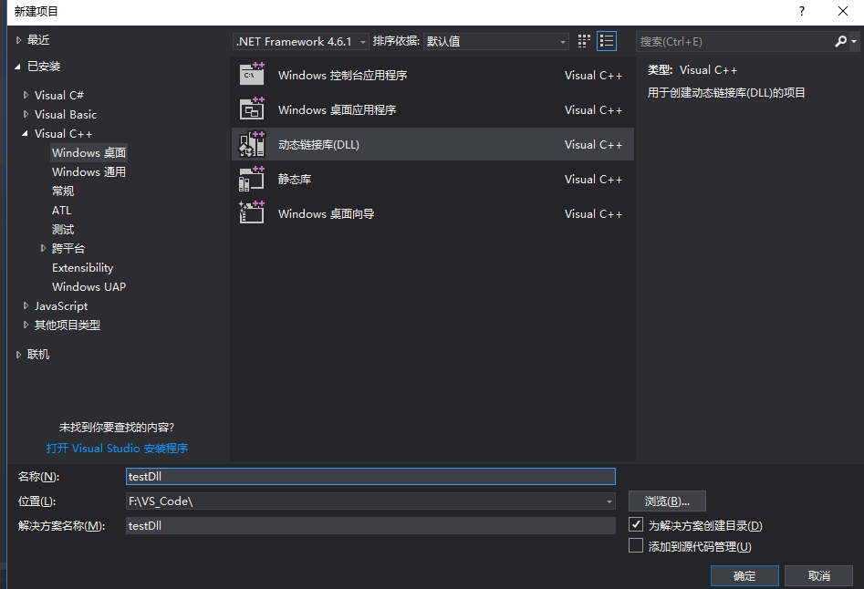
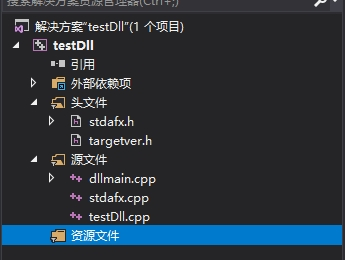
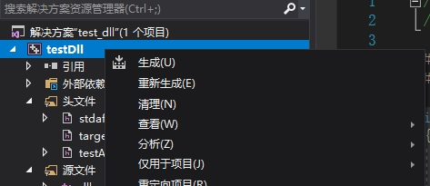

# 1.1 dll创建和使用

## 动态链接库(.dll)的生成
### **1.打开:"文件"-"新建"-"项目"**
### **2.创建DLL项目**


创建后的项目结构



### **3.实现功能接口**
- 添加头文件testAPI.h
```cpp
// testAPI.h
_declspec(dllexport) int test_echo(int i, int(*call_back)(int a, int b));
```
- 实现源接口testDll.cpp
```cpp
int test_echo(int i, int (*call_back)(int a, int b))
{
	int aa;
	
	aa = i * i;
	call_back(i, aa);

	return 0;
}
```

### **4.生成dll文件**


到此为止dll文件已经生成.下一步介绍调用dll动态库.

## DLL库的调用


